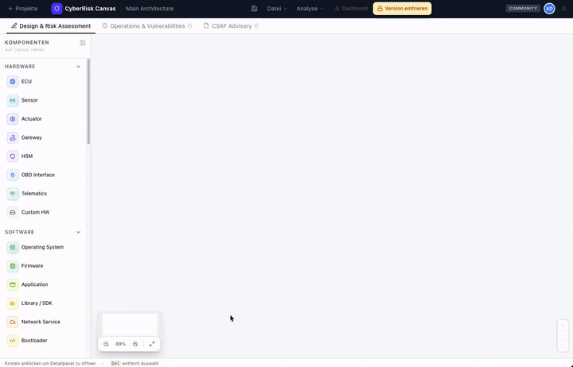

# CyberRisk Canvas

Open-source cybersecurity engineering platform for product security teams - threat analysis & risk assessment (TARA), SBOM/vulnerability management, and compliance documentation under **IEC 62443**, **EU CRA**, and **NIS-2**. STRIDE-based threat modeling, zone/conduit mapping, and OSV.dev-backed vulnerability triage for automotive, industrial automation (OT/SCADA), and IoT teams. Self-hosted and collaborative: your data never leaves your infrastructure.

> **Open Core** - The full TARA workflow is free and open source. [Pro features](#pro-license) are available with a license key.



---

## Requirement mapping

Where each compliance obligation is actually covered in the product:

| Requirement | What it demands | Covered by |
| --- | --- | --- |
| **EU CRA Annex I, Part I** — risk assessment | Systematic cybersecurity risk assessment across the product lifecycle | Visual architecture canvas, STRIDE threat modeling, BSI Annex D likelihood calculator |
| **EU CRA Annex I, ER.0–ER.14a** | Essential cybersecurity requirements (secure by design/default, vulnerability handling capability) | Requirement-by-requirement mapping in the TARA workflow |
| **EU CRA Art. 13** — SBOM | Software bill of materials covering top-level dependencies | CycloneDX 1.2-1.6 / SPDX 2.x SBOM import with BSI TR-03183-2 taxonomy + OSV.dev vulnerability detection |
| **EU CRA Annex I, Part II, VH.1–VH.8a** | Vulnerability handling process obligations | CSAF 2.0 wizard, CycloneDX VEX 1.4 export, CRA Art. 14 notification tracker (24h/72h/14d), periodic OSV.dev re-scan |
| **EU CRA Module H / Annex VII** | Statement of Applicability & technical documentation | Audit-ready PDF export, frozen version snapshots (TARA + SBOM) |
| **IEC 62443** | Zone/conduit modeling, control mapping | Zone/conduit modeling on the canvas, IEC 62443 control mapping |
| **NIS-2 (Art. 21/23)** | Risk-assessment and incident-reporting documentation | TARA workflow + audit trail (risk-assessment slice; not a full GRC platform) |

See [cyberriskcanvas.com](https://cyberriskcanvas.com) for the EU CRA / IEC 62443 background and a live demo (no signup).

---

## Features

### Community (free)

- Visual architecture canvas - drag-and-drop components, data flows, trust boundaries
- TARA workflow - STRIDE classification, risk assessment, treatment tracking
- **BSI TR-03183-1 Asset Catalog** - pre-defined data, functional, and security protection assets with baseline C/I/A ratings
- **BSI Annex D Environment Calculator** - objective likelihood formula based on interface, access, and user capability
- **BSI TR-03185 SDL Checklists** - developer checklists for proprietary software (`PROD.*`), open source (`OSS.*`), and AI governance (`AI.*`)
- **Harmonized CRA Annex I Mapping** - official `ER.0–ER.14a` and `VH.1–VH.8a` requirements with legacy alias resolution
- IEC 62443 control mapping
- Real-time collaboration
- Team management (product teams + cross-functional review teams)
- Self-hosted - your data never leaves your infrastructure

### Pro (license key required)

- Audit-ready PDF export with company logo & CRA Annex VII technical dossier
- **Project versioning** - freeze versions with TARA + SBOM snapshots, CSAF advisory global across versions
- **BSI TR-03183-2 SBOM export** (CycloneDX 1.6 & SPDX 3.0.1) with official BSI property taxonomy (`bsi:component:*`, SHA-512)
- **BSI TR-03183-3 security.txt & CVD policy generator** (RFC 9116 / RFC 9580)
- **CRA Article 14 statutory reporting tracker** (24h early warning, 72h report, 14-day final report to CERT-Bund & ENISA)
- **CRA Statement of Applicability (SoA)** export in JSON, CSV, and Markdown formats for Module H
- **NIST OSCAL v1.1.0** machine-readable assessment results export
- AI threat analysis - CWE suggestions, scenario generation, IEC 62443 recommendations
- **SBOM import** (CycloneDX 1.2-1.6 + SPDX 2.x) with automatic vulnerability detection via OSV.dev
- **CVE monitoring** - periodic re-scan of all uploaded SBOMs against OSV.dev, plus a cross-project **Security Overview** for review teams and admins
- **VEX export** (CycloneDX VEX 1.4) and **CSAF 2.0 advisory** wizard
- Attack path visualization
- Change history & audit trail
- White-label reports
- REST API access with Bearer token authentication (SBOM, Triage, Versioning, CSAF, SoA, OSCAL)
- **Single Sign-On (SSO)** - generic OIDC (Keycloak, Okta, Auth0, ...) and Microsoft Entra ID

---

## Quick Start

**Requirements:** Docker, Docker Compose

```bash
# 1. Download the compose file and example config
curl -O https://raw.githubusercontent.com/cyberriskcanvas/cyberriskcanvas-app/main/docker-compose.yml
curl -O https://raw.githubusercontent.com/cyberriskcanvas/cyberriskcanvas-app/main/.env.example
cp .env.example .env

# 2. Edit .env - set ADMIN_EMAIL, ADMIN_PASSWORD, NEXTAUTH_SECRET, POSTGRES_PASSWORD
#    Generate NEXTAUTH_SECRET with: openssl rand -base64 32

# 3. Start
docker compose up -d
```

The app runs at `http://localhost:3000`. The first admin user is created automatically from `ADMIN_EMAIL` / `ADMIN_PASSWORD` on first start.

---

## Configuration

| Variable | Required | Default | Description |
| --- | --- | --- | --- |
| `POSTGRES_PASSWORD` | ✓ | - | PostgreSQL password |
| `NEXTAUTH_SECRET` | ✓ | - | Random secret for session signing (`openssl rand -base64 32`) |
| `APP_URL` | | `http://localhost:3000` | Public URL of the app (used for auth callbacks) |
| `ADMIN_EMAIL` | ✓ | - | First admin user email |
| `ADMIN_PASSWORD` | ✓ | - | First admin user password |
| `ADMIN_NAME` | | `Admin` | Display name for the first admin user |
| `PORT` | | `3000` | Host port the app listens on |
| `ANTHROPIC_API_KEY` | | - | Claude API key - required for AI features (Pro) |
| `CVE_SCAN_SECRET` | | - | Bearer secret for the periodic CVE re-scan endpoint (`openssl rand -base64 32`); unset disables it |
| `CVE_SCAN_INTERVAL_SECONDS` | | `21600` | How often the bundled `cve-scan` sidecar triggers a re-scan (seconds) |
| `DATABASE_URL` | | auto | Postgres connection string (auto-configured in Docker Compose) |

> **Pro license** is activated in the admin UI at **Settings → License**, not via an environment variable.

See [`.env.example`](.env.example) for the full list.

---

## Project Versioning (Pro)

Each project follows a versioned lifecycle designed for CRA/IEC 62443 audit trails:

```text
Project
├── Version 1  (frozen)  ← TARA snapshot + SBOM + vulnerability triage
├── Version 2  (frozen)  ← TARA snapshot + SBOM + vulnerability triage
└── Version 3  (active)  ← current work in progress
```

**How it works:**

1. Work on the canvas (TARA) and upload an SBOM in the **Operations** tab.
2. Triage all discovered vulnerabilities (set VEX status + justification).
3. When a release is ready, **freeze the version** - this captures the diagram state as an immutable snapshot and links it to the SBOM/vulnerability data.
4. A new active version is created automatically. Work continues there.
5. The **CSAF Advisory** tab is global: it aggregates vulnerability data across all versions and guides through a wizard to produce a standards-compliant CSAF 2.0 + CycloneDX VEX 1.4 export.

TARA and SBOM are version-scoped. The CSAF advisory and API keys are project-scoped.

---

## CVE Monitoring & Security Overview (Pro)

SBOM uploads are checked against [OSV.dev](https://osv.dev/) on import, but new CVEs are disclosed continuously - a component that was clean yesterday can be vulnerable today. The optional periodic re-scan keeps findings current without anyone re-uploading anything:

1. Set `CVE_SCAN_SECRET` in `.env` (`openssl rand -base64 32`).
2. Enable the bundled sidecar service, which calls the internal re-scan endpoint on a schedule (default every 6 hours, configurable via `CVE_SCAN_INTERVAL_SECONDS`) from inside the Docker network - no public exposure required:

   ```bash
   docker compose --profile cve-scan up -d
   ```

   Alternatively, point any external scheduler that can reach the app at `POST /api/internal/cve-scan` with header `Authorization: Bearer <CVE_SCAN_SECRET>`.

   > Once started, the sidecar restarts itself and keeps running on every later `docker compose up -d` - with or without `--profile cve-scan`. To turn it off again, stop and remove it explicitly: `docker compose stop cve-scan && docker compose rm -f cve-scan`.

Re-scans only add `lastSeenAt` timestamps to findings that are re-confirmed and create new findings for newly-disclosed CVEs - existing VEX status and justification are never overwritten.

Admins and members of **review teams** additionally get a cross-project **Security Overview** at `/security`, aggregating findings across every visible project - grouped by advisory so the same vulnerable component shared by several projects can be triaged once.

---

## REST API (Pro)

All API endpoints require a valid **Pro license** and a **Bearer token** generated in **Settings → API Keys**.

```http
Authorization: Bearer crc_<your-key>
```

Full interactive documentation is available at `/api/api-docs` on your instance.  
The raw OpenAPI 3.1 spec is served at `/api/openapi.json`.

### Endpoints

#### Versioning

| Method | Path | Description |
| --- | --- | --- |
| `GET` | `/api/projects/{id}/versions` | List all versions with SBOM and vulnerability counts |
| `POST` | `/api/projects/{id}/versions/{vid}/freeze` | Freeze a version and auto-create the next active version |

#### SBOM

| Method | Path | Description |
| --- | --- | --- |
| `POST` | `/api/projects/{id}/sbom` | Upload a CycloneDX or SPDX BOM (uploads to the active version) |

#### Vulnerabilities

| Method | Path | Description |
| --- | --- | --- |
| `GET` | `/api/projects/{id}/vulnerabilities` | List vulnerabilities of the active version |
| `GET` | `/api/projects/{id}/vulnerabilities?version=N` | List vulnerabilities of a specific frozen version |
| `PATCH` | `/api/projects/{id}/vulnerabilities/{vulnId}` | Set VEX status and justification |

#### CSAF / VEX Export

| Method | Path | Description |
| --- | --- | --- |
| `GET` | `/api/projects/{id}/csaf` | Generate CycloneDX VEX 1.4 + CSAF 2.0 advisory (aggregates all versions) |

### Quick Examples

```bash
BASE=https://your-instance.example.com
TOKEN=crc_your_key_here
PROJECT=cldxyz123abc

# Upload an SBOM (attaches to the active version)
curl -X POST "$BASE/api/projects/$PROJECT/sbom" \
  -H "Authorization: Bearer $TOKEN" \
  -F "file=@sbom.cyclonedx.json"

# List all project versions
curl "$BASE/api/projects/$PROJECT/versions" \
  -H "Authorization: Bearer $TOKEN"

# List vulnerabilities (active version)
curl "$BASE/api/projects/$PROJECT/vulnerabilities" \
  -H "Authorization: Bearer $TOKEN"

# List vulnerabilities for frozen version 1
curl "$BASE/api/projects/$PROJECT/vulnerabilities?version=1" \
  -H "Authorization: Bearer $TOKEN"

# Set a vulnerability to "not_affected"
curl -X PATCH "$BASE/api/projects/$PROJECT/vulnerabilities/clvuln456" \
  -H "Authorization: Bearer $TOKEN" \
  -H "Content-Type: application/json" \
  -d '{"status":"not_affected","justification":"Vulnerable code path not reachable."}'

# Freeze the active version (triggers snapshot + creates next version)
curl -X POST "$BASE/api/projects/$PROJECT/versions/clver789/freeze" \
  -H "Authorization: Bearer $TOKEN" \
  -H "Content-Type: application/json" \
  -d '{"label":"1.0","frozenByName":"Jane Doe"}'

# Export CSAF 2.0 + VEX (aggregates across all versions)
curl "$BASE/api/projects/$PROJECT/csaf" \
  -H "Authorization: Bearer $TOKEN"
```

---

## Single Sign-On (Pro)

Let users authenticate through your organization's identity provider instead of (or in addition to) email/password. Supported out of the box:

- **Generic OIDC** - Keycloak, Okta, Auth0, or any standards-compliant OpenID Connect provider
- **Microsoft Entra ID** (Azure AD)

Configure one or both via environment variables (see [`.env.example`](.env.example) for the full list):

```bash
# Generic OIDC, e.g. Keycloak
OIDC_ISSUER=https://keycloak.example.com/realms/your-realm
OIDC_CLIENT_ID=...
OIDC_CLIENT_SECRET=...
OIDC_NAME=Keycloak          # button label on the sign-in page

# Microsoft Entra ID
ENTRA_ID_CLIENT_ID=...
ENTRA_ID_CLIENT_SECRET=...
ENTRA_ID_TENANT_ID=...
```

Register the redirect URI with your identity provider:

| Provider | Redirect URI |
| --- | --- |
| Generic OIDC | `${APP_URL}/api/auth/callback/oidc` |
| Microsoft Entra ID | `${APP_URL}/api/auth/callback/microsoft-entra-id` |

**How it works:**

- "Sign in with ..." buttons appear on the login page automatically once the corresponding environment variables are set and the instance has a **Pro** license.
- Accounts are **provisioned just-in-time**: the first successful sign-in creates the user (matched by e-mail from the IdP). An admin still needs to add the new user to a team in **Settings → Teams**, exactly as for manually created accounts.
- Email/password sign-in keeps working alongside SSO - existing accounts are unaffected.

---

## Pro License

Pro features require a valid license key from [cyberriskcanvas.com/pricing](https://cyberriskcanvas.com/de#pricing).

| Tier | Monthly | Annual |
| --- | --- | --- |
| Pro | €249/mo | €2,490/yr |

After purchase, enter the license key in the admin UI at **Settings → License**. The app validates the key once per day - no other data is transmitted.

---

## Development

```bash
# Start local services (Postgres + Redis)
docker compose -f docker-compose.local.yml up -d

# Install dependencies
yarn install

# Apply migrations and start
yarn prisma:migrate-deploy
yarn dev
```

---

## Stack

| Layer | Technology |
| --- | --- |
| Framework | Next.js 16, React 19, TypeScript |
| Database | PostgreSQL 17 via Prisma |
| Auth | NextAuth v5 (bcrypt credentials + OIDC/Entra ID SSO) |
| Real-time | Socket.IO + Redis 7 |
| AI | Anthropic Claude (optional) |
| Runtime | Node.js 26 (Alpine) |
| Deployment | Docker Compose |

---

## Roadmap

- **SIEM integration (Microsoft Sentinel)** - data connector that surfaces vulnerability findings (CVE/OSV ID, severity, CVSS score, affected component, VEX status) from CyberRisk Canvas in Microsoft Sentinel via the existing REST API, so SOC teams can alert on newly disclosed criticals and triage directly from their SIEM

---

## Contributing

Open an [issue](https://github.com/cyberriskcanvas/cyberriskcanvas-app/issues) before submitting large changes. Pull requests are welcome.

---

## License

[Elastic License 2.0 (ELv2)](LICENSE)

Free to self-host and use internally. You may not offer the software as a hosted or managed service to third parties. Pro features are protected by the license key mechanism and may not be circumvented.
